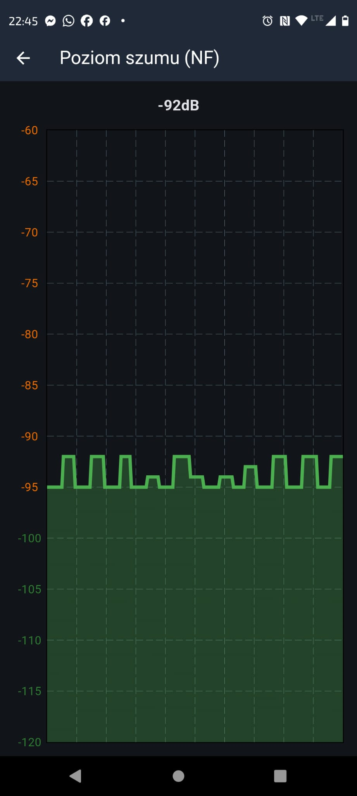
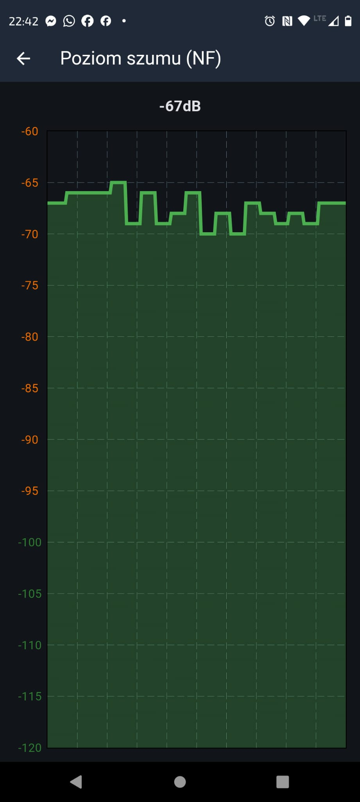
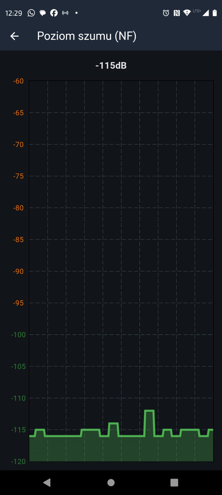
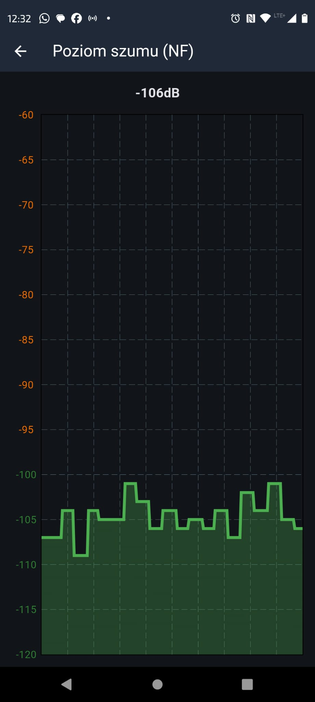

# Heltec V4 LNA control test option

Some Heltec V4 boards include an RF front-end module with a receive LNA path. In normal conditions the LNA should improve sensitivity, but it can also make the receiver more vulnerable to overload or desensitization when the device is installed close to strong out-of-band transmitters, for example near cellular base-station antennas.

The Heltec V4 LNA control option is intended as a field-test and diagnostics switch. It allows the user to leave the RX path in the default LNA-enabled mode, or to force the LNA path off/bypassed after restart. This makes it possible to compare packet reception, noise floor, and practical link behavior without reflashing firmware or changing hardware.

This option is especially useful when testing:

- sites close to BTS/cellular infrastructure or other high-power RF sources;
- locations where the displayed noise floor looks normal, but packet reception is unexpectedly poor;
- installations where adding an external SAW filter may reduce receiver overload;
- Heltec V4.3/KCT8103L FEM behavior compared with the older Heltec V4 FEM path.

The option is not meant to increase transmit power and does not change radio regulatory limits. It only changes the receive front-end LNA state on supported Heltec V4 builds.

## Field comparison

The following photos document a test made near a BTS/cellular site. The second pair was recorded with an external SAW filter inserted before the antenna.

| Setup | LNA off | LNA on |
|:--|:--|:--|
| No external filter |  |  |
| External SAW filter before antenna |  |  |

These test images are included to explain why the firmware exposes the LNA toggle: in strong-RF locations, the best receive setting may need to be verified empirically.
